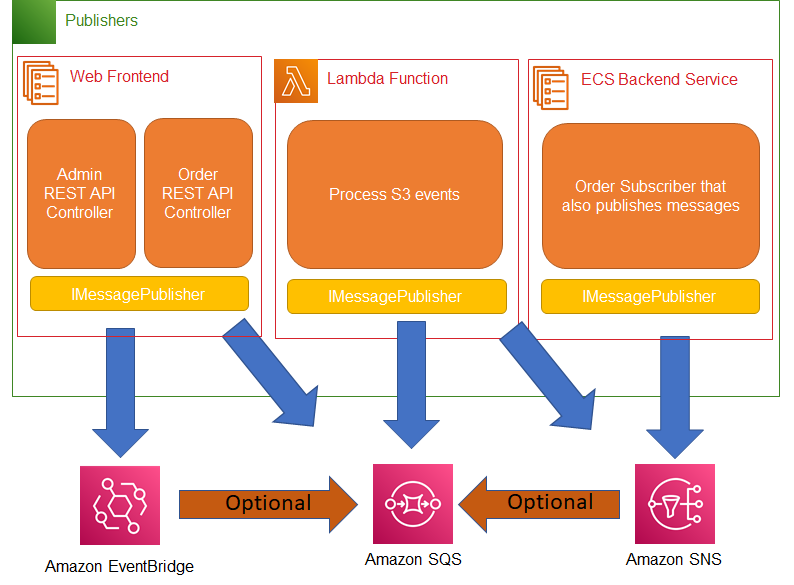
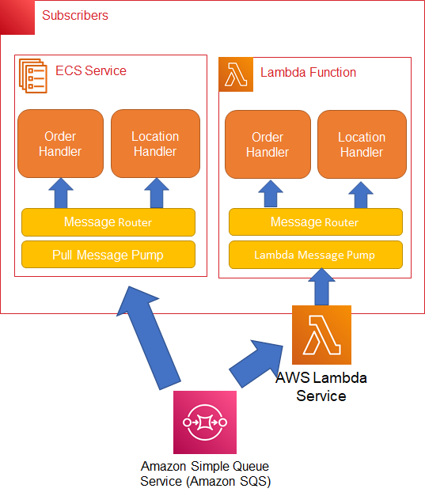

# AWS Message Processing Framework for .NET

## Overview

The AWS Message Processing Framework for .NET is an AWS native framework that simplifies development of .NET message processing applications using AWS services. 

The purpose of the framework is to reduce the amount of boiler-plate code developers need to write. The primary responsibilities of the proposed framework are:

* **Handling the message routing** - In a publisher, the framework will handle routing the messages to the correct queue/topic/eventbus. In a consumer process, it will route the particular message type to the appropriate business logic.
* **Handling the overall message lifecycle**  - The framework will handle serializing/deserializing the message to .NET objects, keeping track of the message visibility while it is being processed, and deleting the message when completed.

## Sample publisher and consumer

Here is an example showing a sample publisher and handler for a hypothetical `ChatMessage` message.

```csharp
[ApiController]
[Route("[controller]")]
public class PublisherController : ControllerBase
{
    private readonly IMessagePublisher _messagePublisher;

    public PublisherController(IMessagePublisher messagePublisher)
    {
        _messagePublisher = messagePublisher;
    }

    [HttpPost("chatmessage", Name = "Chat Message")]
    public async Task<IActionResult> PublishChatMessage([FromBody] ChatMessage message)
    {
        if (message == null)
        {
            return BadRequest("A chat message was not used.");
        }
        if (string.IsNullOrEmpty(message.MessageDescription))
        {
            return BadRequest("The MessageDescription cannot be null or empty.");
        }

        await _messagePublisher.PublishAsync(message);

        return Ok();
    }
}
```

```csharp
public class ChatMessageHandler : IMessageHandler<ChatMessage>
{
    public Task<MessageProcessStatus> HandleAsync(MessageEnvelope<ChatMessage> messageEnvelope, CancellationToken token = default)
    {
        if (messageEnvelope == null)
        {
            return Task.FromResult(MessageProcessStatus.Failed());
        }

        if (messageEnvelope.Message == null)
        {
            return Task.FromResult(MessageProcessStatus.Failed());
        }

        var message = messageEnvelope.Message;

        Console.WriteLine($"Message Description: {message.MessageDescription}");

        return Task.FromResult(MessageProcessStatus.Success());
    }
}
```

## Configuration

Modern .NET heavily uses dependency injection (DI). AWS SDK for .NET integrates with the .NET DI framework using the [.NET Dependency Injection Extensions for AWS SDK for .NET](https://docs.aws.amazon.com/sdk-for-net/v3/developer-guide/net-dg-config-netcore.html#net-core-dependency-injection). Many of AWS's other high level libraries integrate with DI as well.

The AWS Message Processing Framework for .NET will be configured through the DI framework as well.

In order to configure a `Publisher`:

```csharp
var builder = WebApplication.CreateBuilder(args);

// Register the AWS Message Processing Framework for .NET
builder.Services.AddAWSMessageBus(builder =>
{
    // Register a .NET object to an SQS Queue
    builder.AddSQSPublisher<ChatMessage>("https://sqs.us-west-2.amazonaws.com/012345678910/MPF");

    // Register a .NET object to an SNS Topic
    builder.AddSNSPublisher<OrderInfo>("arn:aws:sns:us-west-2:012345678910:MPF");

    // Register a .NET object to an EventBridge Event Bus
    builder.AddEventBridgePublisher<FoodItem>("arn:aws:events:us-west-2:012345678910:event-bus/default");

    // Configure serialization options
    builder.ConfigureSerializationOptions(options =>
    {
        options.SystemTextJsonOptions = new JsonSerializerOptions
        {
            PropertyNamingPolicy = JsonNamingPolicy.CamelCase,
        };
    });
});
```

In order to configure a `Subscriber`:

```csharp
await Host.CreateDefaultBuilder(args)
    .ConfigureServices(services =>
    {
        // Register the AWS Message Processing Framework for .NET
        services.AddAWSMessageBus(builder =>
        {
            // Register an SQS Queue for the message pump to poll for messages
            builder.AddSQSPoller("https://sqs.us-west-2.amazonaws.com/012345678910/MPF");

            // Register a .NET object to a handler to process messages
            builder.AddMessageHandler<ChatMessageHandler, ChatMessage>();
        });
    })
    .Build()
    .RunAsync();
```

## Sending Messages (Publishers)

Once configuration is complete the application can publish messages using an `IMessagePublisher` interface that has been injected via the .NET DI. This `IMessagePublisher` abstracts away the destination and the AWS service that will transport the message. The diagram shows how different types of applications can code their business logic to send messages using the common `IMessagePublisher`. The business logic does not require knowledge about AWS or the destination.



## Consuming Messages (Subscribers)

To consume messages, developers will write a handler class that will contain the business logic for the message. The handler will implement the inteface `IMessageHandler<T>`. During configuration the developer has defined the routes of message types to handlers. The framework will inspect incoming messages for their type, turn the message into a .NET object and then route the message to the correct handler.

In the diagram below a developer would only need to write the handler classes which will contain the business logic. The delivery of the message to the handler and its lifecycle is handled in the lower framework layers.



## Supported Services

The AWS Message Processing Framework for .NET supports the following services:

* **Amazon SQS** - [Amazon SQS](https://aws.amazon.com/sqs/) provides lightweight queues for messages to be sent from publishers to consumers for processing. Consuming messages can be done in parallel across multiple processes. Amazon SQS is commonly used for processing application level events asynchronously. SQS has retry policies and dead-letter queues to handle messages that cannot be processed. SQS can be used as both the publisher and subscriber. The limitation of using Amazon SQS as the publisher is that there can be only one destination.

* **Amazon SNS** - [Amazon SNS](https://aws.amazon.com/sns/) is a messaging service for both application-to-application (A2A) and application-to-person (A2P) communication. Using Amazon SNS as a publisher allows systems to fanout messages to a large number of subscriber systems, including Amazon SQS queues, AWS Lambda functions, HTTPS endpoints, and Amazon Kinesis Data Firehose, for parallel processing.

* **Amazon EventBridge** - [Amazon EventBridge](https://aws.amazon.com/eventbridge/) is commonly used to hook up publishers directly to other AWS services or external third party systems via an EventBus resource. The events are pushed to subscribers based on the EventBridge rules. Common consumers of Amazon EventBridge are Lambda functions, Step Functions, and SQS queues. There is no API to read the events directly from the Amazon EventBridge.

_There are no current plans to support Amazon Kinesis given the service is designed to have a dedicated high level library managing Kinesis shards. We also do not plan to support Amazon MQ - developers should use the community-provided client libraries for ActiveMQ or RabbitMQ. With time, the framework could be extended to support other AWS services, such as AWS Step Functions and Kinesis Data Streams. We could investigate if we could put a subscribe abstraction on top of a Kinesis stream for consuming events. The SQS pull message pump would be replaced with a Kinesis shard message pump._

_**Note**: There are powerful community driven libraries already available to the .NET community like [MassTransit](https://masstransit-project.com/), [Dapr](https://dapr.io/), [NServiceBus](https://github.com/Particular/NServiceBus.AmazonSQS), and others. Unlike those products, The AWS Message Processing Framework for .NET takes hard dependencies on AWS services and is mostly focused on customers that desire AWS support and are not looking for cloud-agnostic solutions. Its intent is to provide a lighter abstraction of our existing low-level APIs and potentially expose AWS features through public APIs. If your application requirements are to be agnostic of the underlying messaging services then the other libraries would be a better fit._

_Community Frameworks (that we know of):_

* https://github.com/justeat/JustSaying
* https://masstransit-project.com/
* https://dapr.io/
* https://github.com/dotnetcloud/SqsToolbox
* https://github.com/nwestfall/MessageDelivery
* https://github.com/BrighterCommand/Brighter
* https://github.com/Particular/NServiceBus.AmazonSQS
* https://github.com/albumprinter/Albelli.Templates.Amazon

## Security

See [CONTRIBUTING](CONTRIBUTING.md#security-issue-notifications) for more information.

## License

This project is licensed under the Apache-2.0 License.

